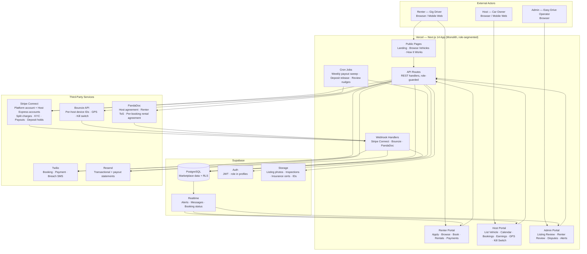
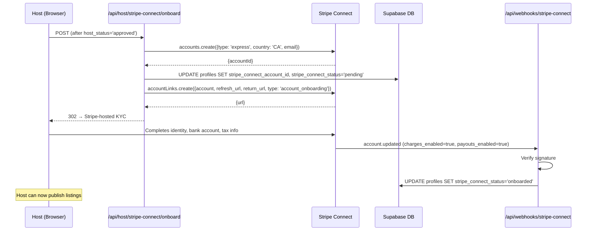
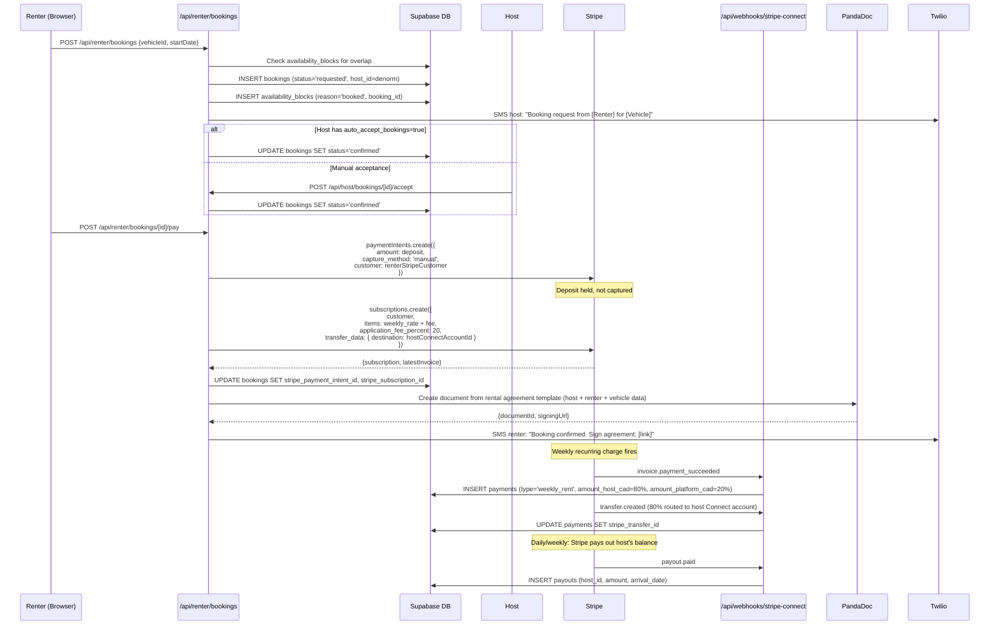
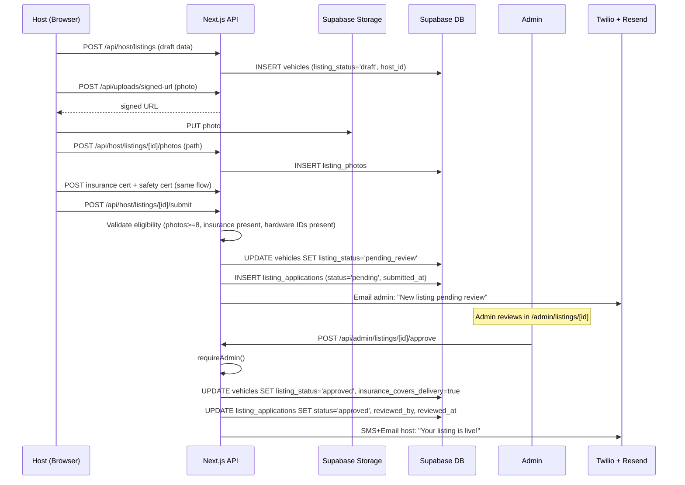
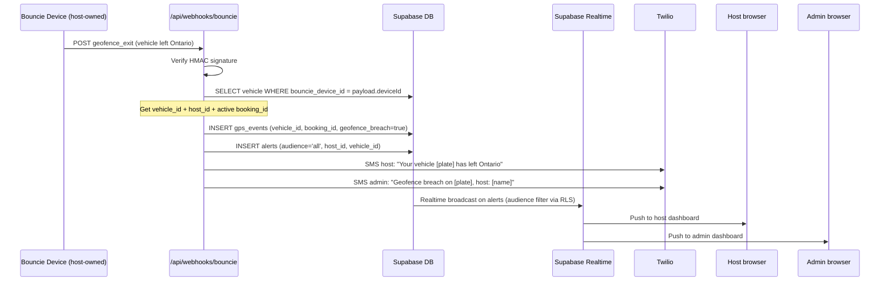

# Easy Drive — Solution Architecture
**Lead Solutions Architect Document**
**Version 2.0 | May 2026 | Marketplace Model**

> *"The platform owns no cars. The platform owns the trust."*
> Philosophy: managed services over self-hosted, monolith over microservices at this stage,
> security by design from day one, and a hard architectural separation between platform
> responsibilities and the bilateral host-renter relationship.

---

## 0. What Changed from v1.0 (Fleet) to v2.0 (Marketplace)

Easy Drive pivoted from a fleet-ownership model to a Turo-style peer-to-peer marketplace.
The platform no longer owns vehicles. Car owners (Hosts) list their own vehicles; gig drivers
(Renters) book them. Easy Drive takes a 20% commission and acts as the trust, payments, and
enforcement layer.

The implications for architecture are large:

| Concern | v1.0 (Fleet) | v2.0 (Marketplace) |
|---|---|---|
| User roles | admin, renter | admin, **host**, renter |
| Vehicle ownership | Easy Drive | Host (per-vehicle `host_id`) |
| Vehicle approval | None — admin adds | **Listing application + admin review** |
| Pricing | Admin sets a fixed rate | **Host sets rate; renter pays rate + 20%** |
| Payments | Stripe subscription, single payee | **Stripe Connect — split charge to host + platform** |
| Payouts | N/A | **Weekly automatic payouts to host Stripe accounts** |
| Rental creation | Admin-initiated | **Renter-initiated booking request; host accepts** |
| Availability | Always-available implicit | **Per-vehicle availability calendar** |
| Ratings | None | **Two-sided ratings (host↔renter↔vehicle)** |
| Kill switch | Admin only | **Host-initiated allowed, fully audited** |
| Insurance | Fleet policy held by Easy Drive | **Per-host commercial endorsement uploaded for review** |
| GPS device ownership | Easy Drive owns | **Host owns; platform stores device ID per vehicle** |
| Messaging | N/A | **Host ↔ Renter in-app messaging (Phase 2)** |

The data model, RLS policies, payments integration, and admin UI all change as a result.
The tech stack stays the same.

---

## 1. Architecture Decision Summary (ADR)

| Decision | Choice | Rationale |
|---|---|---|
| App framework | Next.js 14 (App Router, TypeScript) | Full-stack monolith; one deploy; serves three role-segmented portals from one codebase |
| Database | Supabase (PostgreSQL) | Managed; Auth + Storage + Realtime + Row Level Security; ideal for multi-role marketplace |
| Hosting | Vercel | Zero-config Next.js deploy; edge functions; scales serverless |
| Payments | **Stripe Connect (Express)** | Split charges (80/20), host onboarding, KYC, payouts, manual capture on deposits — all built in |
| GPS integration | Bouncie API + webhooks | Per-vehicle device IDs registered by hosts; platform reads, hosts and admins both consume |
| SMS | Twilio | Booking, payment, breach, and approval notifications to both sides |
| Email | Resend | Transactional + host payout notices + renter receipts |
| E-signature | PandaDoc API | Host agreement, renter ToS, per-rental host↔renter agreement generated on booking |
| File storage | Supabase Storage | Photos (listing, inspection, damage), insurance certs, IDs, abstracts |
| Auth | Supabase Auth | Single identity table; role enforced in `profiles.role` with RLS |
| Messaging (Phase 2) | Supabase Realtime + Postgres `messages` table | No extra vendor; persisted, auditable, RLS-controlled |
| Background jobs | Vercel Cron + Inngest (Phase 3) | Weekly payouts reconciliation, deposit release SLAs, review reminder fan-out |

**Rejected alternatives:**
- **Plain Stripe Checkout** — cannot do host KYC, cannot split charges to a third-party bank account, cannot do compliant payouts. Stripe Connect is non-negotiable for the marketplace model.
- **Stripe Connect Standard accounts** — pushes the entire dashboard UX to Stripe.com; we want hosts to stay inside the Easy Drive portal. Express is the right balance: Stripe handles KYC, Easy Drive owns the UX.
- **Firebase / Firestore** — relational data (bookings, payouts, ratings, availability) needs SQL joins and constraints; document DB is the wrong fit.
- **Building our own escrow** — illegal without a money services business license. Stripe Connect's hold/transfer model is the legal, compliant primitive.
- **Microservices** — overkill at 10–50 listings; adds operational drag with no operator team.
- **Twilio Conversations for messaging** — adds cost and lock-in; Postgres + Realtime is sufficient at this scale.

---

## 2. High-Level System Architecture



**Key topology decisions:**
- One Next.js app, three route groups (`(public)`, `(renter)`, `(host)`, `(admin)`) — same deploy, same runtime, role enforced by middleware + RLS.
- All third-party calls go through `/lib/*` server-side wrappers; no third-party SDKs in browser bundles.
- Webhooks are the source of truth for payment state — never trust the client's "I paid" claim.

---

## 3. Data Architecture

### 3.1 Entity Relationship Diagram

```mermaid
erDiagram
    PROFILES {
        uuid id PK
        uuid auth_user_id FK
        text role "admin | host | renter"
        text full_name
        text phone
        text email
        text avatar_url
        text stripe_customer_id "renter side"
        text stripe_connect_account_id "host side - Express account"
        text stripe_connect_status "pending | onboarded | restricted | disabled"
        text ontario_licence_number "renter only"
        text licence_class "renter only"
        int at_fault_accidents "renter only"
        bool licence_suspended "renter only"
        text gig_platform "renter only"
        text gig_account_screenshot_url "renter only"
        text id_document_url
        text driver_abstract_url "renter only"
        text renter_status "pending | approved | suspended | rejected"
        text host_status "pending | approved | suspended | rejected"
        decimal avg_rating_as_renter
        decimal avg_rating_as_host
        int rentals_completed_as_renter
        int rentals_completed_as_host
        timestamp created_at
    }

    VEHICLES {
        uuid id PK
        uuid host_id FK "owner of the vehicle"
        text make
        text model
        int year
        text vin
        text plate_number
        text colour
        int odometer_km
        text trim
        text transmission
        text fuel_type
        int seats
        text city "GTA submarket - Toronto, Mississauga, Brampton, etc."
        text pickup_postal_code
        int weekly_rate_cad "host-set base rate"
        bool auto_accept_bookings
        text listing_status "draft | pending_review | approved | active | paused | delisted"
        text rejection_reason
        text bouncie_device_id
        text passtime_device_id
        text safety_cert_url
        timestamp safety_cert_expires
        text insurance_cert_url
        timestamp insurance_cert_expires
        bool insurance_covers_delivery "admin attestation"
        decimal avg_rating
        int rentals_completed
        timestamp listed_at
        timestamp created_at
    }

    LISTING_PHOTOS {
        uuid id PK
        uuid vehicle_id FK
        text storage_path
        text caption
        int sort_order
        bool is_primary
        timestamp created_at
    }

    LISTING_APPLICATIONS {
        uuid id PK
        uuid vehicle_id FK
        uuid host_id FK
        text status "pending | needs_changes | approved | rejected"
        text admin_notes
        text rejection_reason
        uuid reviewed_by FK
        timestamp submitted_at
        timestamp reviewed_at
    }

    AVAILABILITY_BLOCKS {
        uuid id PK
        uuid vehicle_id FK
        date start_date
        date end_date
        text reason "host_blocked | booked | maintenance"
        uuid booking_id FK "null if host_blocked or maintenance"
        timestamp created_at
    }

    RENTER_APPLICATIONS {
        uuid id PK
        uuid renter_id FK
        text status "pending | approved | rejected"
        text rejection_reason
        uuid reviewed_by FK
        timestamp submitted_at
        timestamp reviewed_at
    }

    BOOKINGS {
        uuid id PK
        uuid renter_id FK
        uuid host_id FK "denormalized for RLS speed"
        uuid vehicle_id FK
        text status "requested | confirmed | declined | active | completed | cancelled | disputed"
        date start_date
        date end_date "open-ended weekly auto-renew if null"
        int weekly_rate_cad "snapshot of host rate at booking"
        int platform_fee_cad "20% of weekly_rate"
        int deposit_cad "default 500"
        text stripe_payment_intent_id "deposit hold"
        text stripe_subscription_id "weekly recurring split charge"
        text pandadoc_document_id
        text pandadoc_status
        timestamp requested_at
        timestamp confirmed_at
        timestamp activated_at
        timestamp completed_at
        timestamp cancelled_at
    }

    PAYMENTS {
        uuid id PK
        uuid booking_id FK
        text stripe_payment_intent_id
        text stripe_transfer_id "transfer to host"
        text stripe_charge_id
        text type "deposit_hold | deposit_release | deposit_capture | weekly_rent | refund"
        int amount_total_cad "what renter paid"
        int amount_host_cad "host's share"
        int amount_platform_cad "Easy Drive's share"
        int stripe_fee_cad
        text status "pending | succeeded | failed | refunded"
        timestamp processed_at
        timestamp created_at
    }

    PAYOUTS {
        uuid id PK
        uuid host_id FK
        text stripe_payout_id
        int amount_cad
        text status "pending | in_transit | paid | failed"
        date period_start
        date period_end
        timestamp arrival_date
        timestamp created_at
    }

    INSPECTIONS {
        uuid id PK
        uuid booking_id FK
        text type "pickup | return"
        uuid conducted_by FK "host or renter"
        int odometer_km
        int fuel_level_pct
        text notes
        json photo_urls
        timestamp conducted_at
    }

    DAMAGE_CLAIMS {
        uuid id PK
        uuid booking_id FK
        uuid submitted_by FK "host"
        text description
        json photo_urls
        int estimated_cost_cad
        text status "submitted | under_review | approved | denied | escalated_to_insurance"
        int deposit_applied_cad
        text admin_decision_notes
        uuid resolved_by FK
        timestamp submitted_at
        timestamp resolved_at
    }

    MAINTENANCE_LOGS {
        uuid id PK
        uuid vehicle_id FK
        uuid recorded_by FK "host"
        text type "oil | tires | brakes | safety_cert | other"
        int cost_cad
        int odometer_at_service
        text notes
        text receipt_url
        timestamp serviced_at
    }

    REVIEWS {
        uuid id PK
        uuid booking_id FK
        uuid author_id FK
        uuid subject_id FK "the person being rated"
        uuid vehicle_id FK "null when reviewing a renter"
        text direction "host_to_renter | renter_to_host | renter_to_vehicle"
        int rating "1-5"
        text comment
        bool is_public
        timestamp created_at
    }

    GPS_EVENTS {
        uuid id PK
        uuid vehicle_id FK
        uuid booking_id FK "active booking at time of event"
        text event_type "location | speed | geofence_breach | ignition_on | ignition_off"
        decimal lat
        decimal lng
        int speed_kmh
        bool geofence_breach
        json raw_payload
        timestamp occurred_at
    }

    KILL_SWITCH_LOGS {
        uuid id PK
        uuid vehicle_id FK
        uuid booking_id FK
        uuid initiated_by FK
        text initiator_role "admin | host"
        text action "disable | enable"
        text reason
        text bouncie_response
        timestamp acted_at
    }

    ALERTS {
        uuid id PK
        uuid vehicle_id FK
        uuid booking_id FK
        uuid host_id FK "for host-routed alerts"
        text type "geofence_breach | payment_failed | kill_switch_activated | booking_request | listing_pending | damage_claim"
        text severity "info | warning | critical"
        text audience "admin | host | renter | all"
        text message
        bool acknowledged
        uuid acknowledged_by FK
        timestamp created_at
    }

    MESSAGES {
        uuid id PK
        uuid booking_id FK
        uuid sender_id FK
        text body
        json attachment_urls
        bool read_by_recipient
        timestamp sent_at
    }

    PROFILES ||--o{ VEHICLES : owns_as_host
    PROFILES ||--o{ RENTER_APPLICATIONS : submits
    VEHICLES ||--o{ LISTING_PHOTOS : has
    VEHICLES ||--o{ LISTING_APPLICATIONS : undergoes
    VEHICLES ||--o{ AVAILABILITY_BLOCKS : has
    VEHICLES ||--o{ MAINTENANCE_LOGS : has
    VEHICLES ||--o{ GPS_EVENTS : emits
    VEHICLES ||--o{ KILL_SWITCH_LOGS : audited_by
    PROFILES ||--o{ BOOKINGS : rents
    VEHICLES ||--o{ BOOKINGS : booked_in
    BOOKINGS ||--o{ PAYMENTS : generates
    PROFILES ||--o{ PAYOUTS : receives
    BOOKINGS ||--o{ INSPECTIONS : triggers
    BOOKINGS ||--o{ DAMAGE_CLAIMS : may_have
    BOOKINGS ||--o{ REVIEWS : produces
    BOOKINGS ||--o{ MESSAGES : threaded_in
    BOOKINGS ||--o{ ALERTS : associated_with
    VEHICLES ||--o{ ALERTS : raises
```



### 3.2 Key Design Decisions

- **Single `profiles` table for all roles** — admin, host, renter all live in one table. `role` discriminates. A user can theoretically be both host and renter, but for v1 we will allow one role per profile to avoid policy ambiguity. RLS keys off this field.
- **`vehicles.host_id`** — every vehicle belongs to exactly one host. Foreign key to `profiles(id)` where `role='host'`. Deletion of a host is **soft only** when active bookings exist.
- **Listing approval = data, not workflow engine** — `vehicles.listing_status` is the source of truth. `listing_applications` is the **audit trail** of submissions and admin decisions, including rejections and re-submissions. We do not need a state machine library; status transitions are enforced in a single `lib/listing/transitions.ts` module.
- **`availability_blocks` unifies three concerns** — host-blocked dates, confirmed-booking dates, and maintenance windows all live here. A vehicle is bookable on a given range iff no overlapping row exists. This is a single index lookup on `(vehicle_id, daterange)` using PostgreSQL's `daterange` and `&&` overlap operator with a GiST exclusion constraint.
- **`bookings.host_id` is denormalized** — the host is reachable via `vehicles.host_id`, but RLS policies need the host on the row itself for fast filter. We populate it on insert (DB trigger).
- **`payments` splits the money three ways** — `amount_total_cad` (what renter paid), `amount_host_cad` (host's 80%), `amount_platform_cad` (our 20%), and `stripe_fee_cad` (Stripe's cut, deducted from platform side). This makes reconciliation against Stripe Balance Transactions trivial.
- **`payouts` is separate from `payments`** — Stripe Connect emits a separate `payout.paid` event when funds actually leave the platform balance and land in the host's bank. We track that lifecycle independently for host-facing earnings pages.
- **`reviews.direction`** — three flavours of review: host→renter, renter→host, renter→vehicle. The first two are reputation; the third is product (the listing). We allow public rendering of renter→host and renter→vehicle, but host→renter ratings are only visible to admins and other hosts considering a future booking.
- **`gps_events` is append-only** — never updated. Used for breach detection, dispute evidence, and host's live-view dashboard. Hot-partition concern at scale; addressed with monthly partitioning in Phase 3.
- **`kill_switch_logs` is a hard audit trail** — every kill switch action by anyone (host or admin) is recorded with initiator, role, reason, and the raw response from Bouncie. This protects Easy Drive in any future legal dispute about platform overreach.
- **`messages` is bounded to a `booking_id`** — no DMs outside a booking context. Eliminates an entire class of abuse and keeps messages legally tied to a transaction.

### 3.3 Indexes and Constraints (notable)

```sql
-- A vehicle cannot be double-booked
ALTER TABLE availability_blocks
  ADD CONSTRAINT no_overlapping_blocks
  EXCLUDE USING GIST (
    vehicle_id WITH =,
    daterange(start_date, end_date, '[]') WITH &&
  );

-- A host cannot list a vehicle without a Stripe Connect account onboarded
ALTER TABLE vehicles
  ADD CONSTRAINT host_must_be_onboarded
  CHECK (listing_status IN ('draft','pending_review') OR host_id IN (
    SELECT id FROM profiles WHERE stripe_connect_status = 'onboarded'
  ));  -- enforced via trigger in practice; CHECK with subquery isn't portable

-- Reviews are one-per-booking-per-direction
CREATE UNIQUE INDEX one_review_per_booking_direction
  ON reviews (booking_id, direction);

-- Booking lookup hot paths
CREATE INDEX bookings_renter_status ON bookings(renter_id, status);
CREATE INDEX bookings_host_status ON bookings(host_id, status);
CREATE INDEX bookings_vehicle_active ON bookings(vehicle_id) WHERE status IN ('confirmed','active');

-- GPS events by vehicle and time
CREATE INDEX gps_events_vehicle_time ON gps_events(vehicle_id, occurred_at DESC);
```

---

## 4. Application Structure

```
easy-drive/
├── app/
│   ├── (public)/
│   │   ├── page.tsx                          # Landing — two CTAs: "List Your Car" / "Rent a Car"
│   │   ├── how-it-works/page.tsx
│   │   ├── pricing/page.tsx                  # Platform fee breakdown for both sides
│   │   ├── browse/
│   │   │   ├── page.tsx                      # Public vehicle marketplace (filters: city, price, type)
│   │   │   └── [vehicleId]/page.tsx          # Public listing detail page
│   │   ├── become-a-host/page.tsx
│   │   ├── apply-renter/page.tsx             # Renter application entry
│   │   └── apply-host/page.tsx               # Host application entry
│   │
│   ├── (renter)/
│   │   └── renter/
│   │       ├── layout.tsx                    # Auth guard: role='renter', renter_status='approved'
│   │       ├── page.tsx                      # Renter dashboard: active rental, upcoming payment
│   │       ├── browse/page.tsx               # Authenticated browse (saved searches)
│   │       ├── bookings/
│   │       │   ├── page.tsx                  # All my bookings
│   │       │   ├── new/[vehicleId]/page.tsx  # Booking wizard: dates → fees → checkout
│   │       │   └── [bookingId]/
│   │       │       ├── page.tsx              # Booking detail
│   │       │       ├── messages/page.tsx     # Thread with host (Phase 2)
│   │       │       ├── inspection/page.tsx   # Renter-side inspection capture
│   │       │       └── review/page.tsx       # Leave host + vehicle review
│   │       ├── payments/page.tsx             # Payment history; Stripe customer portal link
│   │       └── profile/page.tsx              # ID/abstract management
│   │
│   ├── (host)/
│   │   └── host/
│   │       ├── layout.tsx                    # Auth guard: role='host', host_status='approved'
│   │       ├── page.tsx                      # Host dashboard: earnings YTD, active bookings, alerts
│   │       ├── onboarding/
│   │       │   ├── page.tsx                  # Stripe Connect Express onboarding
│   │       │   └── stripe-return/page.tsx    # Return URL after Stripe-hosted KYC
│   │       ├── listings/
│   │       │   ├── page.tsx                  # All my listings
│   │       │   ├── new/page.tsx              # Multi-step listing wizard
│   │       │   └── [vehicleId]/
│   │       │       ├── page.tsx              # Edit listing (rate, photos)
│   │       │       ├── calendar/page.tsx     # Availability calendar (block dates)
│   │       │       ├── live/page.tsx         # GPS live view (Bouncie)
│   │       │       ├── kill-switch/page.tsx  # Kill switch panel (audited)
│   │       │       └── maintenance/page.tsx  # Maintenance log
│   │       ├── bookings/
│   │       │   ├── page.tsx                  # Incoming + active bookings
│   │       │   └── [bookingId]/
│   │       │       ├── page.tsx              # Accept/decline; pickup logistics
│   │       │       ├── messages/page.tsx     # Thread with renter
│   │       │       ├── inspection/page.tsx
│   │       │       ├── damage-claim/page.tsx # Submit damage claim with photos
│   │       │       └── review/page.tsx       # Rate the renter
│   │       └── earnings/
│   │           ├── page.tsx                  # Earnings dashboard, weekly payouts
│   │           └── statements/page.tsx       # Downloadable statements
│   │
│   ├── (admin)/
│   │   └── admin/
│   │       ├── layout.tsx                    # Auth guard: role='admin'
│   │       ├── page.tsx                      # Ops dashboard: alerts, KPIs
│   │       ├── listings/
│   │       │   ├── page.tsx                  # Listing review queue
│   │       │   └── [vehicleId]/page.tsx      # Review insurance, photos, hardware → approve/reject
│   │       ├── renters/
│   │       │   ├── page.tsx                  # Renter application queue
│   │       │   └── [renterId]/page.tsx       # Review licence/abstract/gig acct → approve/reject
│   │       ├── hosts/
│   │       │   ├── page.tsx                  # All hosts, Connect status, payout health
│   │       │   └── [hostId]/page.tsx
│   │       ├── bookings/
│   │       │   ├── page.tsx                  # All bookings, search, status
│   │       │   └── [bookingId]/page.tsx      # Force-action override (kill switch, refund)
│   │       ├── disputes/
│   │       │   ├── page.tsx                  # Open damage claims
│   │       │   └── [claimId]/page.tsx        # Adjudicate
│   │       ├── alerts/page.tsx               # Realtime alert feed (geofence, payment, kill switch)
│   │       └── financials/
│   │           ├── page.tsx                  # Platform GMV, take rate, payouts
│   │           └── reconciliation/page.tsx   # Match Supabase payments to Stripe Balance Transactions
│   │
│   └── api/
│       ├── webhooks/
│       │   ├── stripe-connect/route.ts       # Connect events: account.updated, transfer.*, payout.*, charge.*
│       │   ├── bouncie/route.ts              # GPS, geofence, ignition events
│       │   └── pandadoc/route.ts             # document.completed, document.declined
│       ├── cron/
│       │   ├── deposit-release/route.ts      # Daily: release deposits 5 business days after clean return
│       │   ├── payout-reconcile/route.ts     # Daily: match Stripe payouts to internal payouts table
│       │   └── review-nudges/route.ts        # Daily: SMS renters/hosts who haven't reviewed
│       ├── public/
│       │   └── vehicles/
│       │       ├── route.ts                  # GET: search listings (filters, anonymized host)
│       │       └── [id]/route.ts             # GET: public listing detail
│       ├── renter/
│       │   ├── applications/route.ts         # POST: submit renter application
│       │   └── bookings/
│       │       ├── route.ts                  # POST: create booking request
│       │       └── [id]/
│       │           ├── route.ts              # GET/PATCH (cancel)
│       │           ├── pay/route.ts          # POST: create Stripe split-charge subscription
│       │           ├── inspection/route.ts   # POST: renter-side inspection
│       │           └── review/route.ts       # POST: renter→host + renter→vehicle review
│       ├── host/
│       │   ├── stripe-connect/
│       │   │   ├── onboard/route.ts          # POST: create Express account + onboarding link
│       │   │   └── dashboard/route.ts        # POST: create Express dashboard link
│       │   ├── listings/
│       │   │   ├── route.ts                  # POST: create listing draft
│       │   │   └── [id]/
│       │   │       ├── route.ts              # GET/PATCH: edit listing
│       │   │       ├── submit/route.ts       # POST: submit for admin review
│       │   │       ├── photos/route.ts       # POST/DELETE: photo management
│       │   │       ├── availability/route.ts # POST/DELETE: block/unblock dates
│       │   │       ├── kill-switch/route.ts  # POST: host-initiated kill switch (audited)
│       │   │       └── maintenance/route.ts  # POST: add maintenance record
│       │   └── bookings/
│       │       └── [id]/
│       │           ├── accept/route.ts       # POST: accept booking request
│       │           ├── decline/route.ts      # POST: decline booking request
│       │           ├── inspection/route.ts   # POST: host-side inspection
│       │           ├── damage-claim/route.ts # POST: file damage claim
│       │           └── review/route.ts       # POST: host→renter review
│       ├── admin/
│       │   ├── listings/[id]/
│       │   │   ├── approve/route.ts          # POST: approve listing → active
│       │   │   ├── reject/route.ts           # POST: reject with reason
│       │   │   └── needs-changes/route.ts    # POST: request changes
│       │   ├── renters/[id]/
│       │   │   ├── approve/route.ts
│       │   │   └── reject/route.ts
│       │   ├── bookings/[id]/
│       │   │   ├── kill-switch/route.ts      # POST: admin-initiated (audited, override)
│       │   │   └── refund/route.ts           # POST: refund renter
│       │   └── disputes/[id]/
│       │       └── resolve/route.ts          # POST: adjudicate damage claim
│       ├── messages/
│       │   └── [bookingId]/route.ts          # GET/POST messages (Phase 2)
│       └── uploads/
│           └── signed-url/route.ts           # POST: get Supabase Storage upload URL
│
├── components/
│   ├── public/
│   │   ├── VehicleCard.tsx
│   │   ├── BrowseFilters.tsx
│   │   └── HowItWorksSteps.tsx
│   ├── renter/
│   │   ├── RenterApplicationForm.tsx
│   │   ├── BookingWizard.tsx                 # Date picker → fee breakdown → Stripe Element
│   │   ├── BookingTimeline.tsx
│   │   └── ReviewForm.tsx
│   ├── host/
│   │   ├── StripeConnectStatus.tsx
│   │   ├── ListingWizard.tsx                 # 5-step: vehicle → photos → insurance → hardware → price
│   │   ├── AvailabilityCalendar.tsx          # react-day-picker w/ blocked ranges
│   │   ├── EarningsChart.tsx
│   │   ├── BookingRequestCard.tsx            # Accept/decline UI with renter profile preview
│   │   ├── HostGpsLive.tsx                   # Map + last-known position
│   │   ├── HostKillSwitchPanel.tsx           # Big-red-button with confirm + reason field
│   │   └── MaintenanceLogTable.tsx
│   ├── admin/
│   │   ├── ListingReviewPanel.tsx            # Side-by-side: insurance cert + photos + checklist
│   │   ├── RenterReviewPanel.tsx
│   │   ├── DisputeAdjudication.tsx
│   │   ├── AlertFeed.tsx                     # Realtime
│   │   └── FleetMap.tsx                      # All vehicles, all hosts, GPS overlay
│   ├── shared/
│   │   ├── MessageThread.tsx                 # Used by both host + renter
│   │   ├── InspectionForm.tsx                # Used at pickup + return by both sides
│   │   ├── RatingDisplay.tsx
│   │   └── PhotoUploader.tsx
│   └── ui/                                   # Shared design system
│
├── lib/
│   ├── supabase/
│   │   ├── client.ts
│   │   ├── server.ts
│   │   └── middleware.ts
│   ├── stripe/
│   │   ├── client.ts                         # Server-side Stripe SDK init
│   │   ├── connect.ts                        # Express account creation, onboarding links
│   │   ├── split-charge.ts                   # Create subscription with application_fee_amount
│   │   ├── deposits.ts                       # Manual capture / release on Connect
│   │   └── webhooks.ts                       # Signature verify + event router
│   ├── bouncie.ts                            # Device read, kill switch toggle, geofence config
│   ├── twilio.ts
│   ├── resend.ts
│   ├── pandadoc.ts                           # Generate per-booking host-renter agreement
│   ├── listing/
│   │   ├── transitions.ts                    # State machine: draft→pending_review→approved→...
│   │   └── eligibility.ts                    # Validate insurance, hardware, photos before submit
│   ├── booking/
│   │   ├── pricing.ts                        # weeklyRate + 20% + deposit math
│   │   ├── availability.ts                   # Range overlap checks against availability_blocks
│   │   └── lifecycle.ts                      # request → confirm → active → complete transitions
│   ├── auth/
│   │   ├── require-role.ts                   # requireAdmin / requireHost / requireRenter
│   │   └── require-onboarded-host.ts         # Throws if Stripe Connect not onboarded
│   └── validations/
│       ├── listing.ts                        # Zod schemas
│       ├── booking.ts
│       ├── renter-application.ts
│       └── review.ts
│
├── supabase/
│   └── migrations/
│       ├── 0001_initial_marketplace_schema.sql
│       ├── 0002_rls_policies.sql
│       ├── 0003_availability_exclusion_constraint.sql
│       └── 0004_triggers_denormalize_host_id.sql
│
├── middleware.ts                              # Role-based route guards
└── package.json
```

---

## 5. Integration Design

### 5.1 Stripe Connect — Host Onboarding



**Why Express accounts:** Stripe handles KYC (Connect compliance is intense in Canada — SIN/business number, beneficial ownership). Host sees a Stripe-branded onboarding flow, then returns to Easy Drive for the actual product experience. We never touch banking data.

### 5.2 Booking + Split Charge



**Critical implementation notes:**
- We use **destination charges with `application_fee_amount`** (not separate charges/transfers). This is the cleanest pattern for marketplaces: renter sees one charge from Easy Drive, Stripe automatically routes 80% to the host, 20% stays with the platform, and Stripe's fees come out of the platform's 20%.
- The **deposit is a separate PaymentIntent with `capture_method: manual`** held by the platform (not transferred). On clean return we cancel/refund the intent. On approved damage claim, we capture some/all and either keep on platform or transfer to host depending on host's repair invoice.
- `application_fee_percent: 20` ensures the 80/20 split is mechanically enforced by Stripe even if a bug in our code passes the wrong totals.

### 5.3 Listing Application + Admin Approval



### 5.4 Bouncie GPS — Per-Host Vehicle Routing



**Key difference vs v1.0:** the webhook resolves a `bouncie_device_id` to a (vehicle, host) tuple — alerts and notifications fan out to **both** the host (whose car it is) and the admin (platform liability). Renter is notified by SMS as well so they have a chance to self-correct before kill switch is triggered.

### 5.5 Kill Switch — Host- and Admin-Initiated, Both Audited

```mermaid
sequenceDiagram
    participant ACTOR as Host or Admin
    participant API as /api/host/listings/[id]/kill-switch OR<br/>/api/admin/bookings/[id]/kill-switch
    participant DB as Supabase DB
    participant BOU as Bouncie API
    participant TW as Twilio + Resend
    participant REN as Renter

    ACTOR->>API: POST {action: 'disable', reason: 'payment_failed'}
    API->>API: requireHost(vehicleId) OR requireAdmin()
    API->>DB: SELECT vehicle, active booking, renter
    API->>DB: INSERT kill_switch_logs (initiator, role, action, reason)
    API->>BOU: setIgnitionInterrupt(deviceId, true)
    BOU-->>API: response
    API->>DB: UPDATE kill_switch_logs SET bouncie_response
    API->>DB: INSERT alerts (type='kill_switch_activated')
    API->>TW: SMS+Email renter: "Your rental vehicle has been remotely disabled. Reason: [...]. Contact [host or admin]."
    API->>TW: SMS host (if admin-initiated) or admin (if host-initiated): notification
```

**Policy:**
- Hosts can disable **only their own vehicles** (RLS enforces). They cannot enable — re-enabling after a payment-failure or breach incident requires admin sign-off, to prevent host-side abuse (e.g., host disables, refuses to re-enable until renter pays extra cash).
- Every kill switch action requires a non-empty `reason` field. The platform stores it for legal defense.
- Renter is **always** notified the moment a kill switch is fired. No silent disables — this is a PIPEDA and trust requirement.

---

## 6. Security Model

### 6.1 Authentication and Authorisation

| Layer | Mechanism |
|---|---|
| Identity | Supabase Auth (JWT, email magic link + password) |
| Session | Supabase session cookies (httpOnly, secure) |
| Role discriminator | `profiles.role` ∈ {`admin`, `host`, `renter`} |
| Status gating | `profiles.host_status` / `profiles.renter_status` must be `approved` to access role portals |
| Route guard (UI) | `app/(host)/host/layout.tsx` and equivalents — server-side check in RSC |
| API guard | `requireRole('host')` / `requireRole('admin')` helpers throw 401/403 |
| Data guard | Postgres Row Level Security (RLS) — defense in depth |
| Webhook security | HMAC signature verification (Stripe, Bouncie, PandaDoc) |
| File access | Supabase Storage signed URLs (1-hour expiry); private buckets only |
| Kill switch | Double-checked: API guard + DB ownership check + audit insert before Bouncie call |

### 6.2 RLS Policy Design — Three Roles

**Profiles:** users see their own profile; admins see all; hosts and renters see a **redacted** version of each other when bound by an active or recent booking.

```sql
-- Self-read
CREATE POLICY profiles_self_select ON profiles
  FOR SELECT USING (auth_user_id = auth.uid());

-- Admin reads all
CREATE POLICY profiles_admin_select ON profiles
  FOR SELECT USING (
    EXISTS (SELECT 1 FROM profiles me WHERE me.auth_user_id = auth.uid() AND me.role = 'admin')
  );

-- Host can read renter profile (limited columns enforced at view level)
-- when bound by an active or recent booking
CREATE POLICY profiles_host_sees_their_renter ON profiles
  FOR SELECT USING (
    role = 'renter' AND id IN (
      SELECT renter_id FROM bookings
       WHERE host_id = (SELECT id FROM profiles WHERE auth_user_id = auth.uid())
         AND status IN ('requested','confirmed','active','completed')
    )
  );

-- Renter can read host profile when bound by booking (symmetric)
CREATE POLICY profiles_renter_sees_their_host ON profiles
  FOR SELECT USING (
    role = 'host' AND id IN (
      SELECT host_id FROM bookings
       WHERE renter_id = (SELECT id FROM profiles WHERE auth_user_id = auth.uid())
         AND status IN ('requested','confirmed','active','completed')
    )
  );
```

**Vehicles:** public can see only `listing_status='approved'`; host sees their own; admin sees all.

```sql
CREATE POLICY vehicles_public_active ON vehicles
  FOR SELECT USING (listing_status IN ('approved','active'));

CREATE POLICY vehicles_host_own ON vehicles
  FOR ALL USING (
    host_id = (SELECT id FROM profiles WHERE auth_user_id = auth.uid())
  );

CREATE POLICY vehicles_admin_all ON vehicles
  FOR ALL USING (
    EXISTS (SELECT 1 FROM profiles WHERE auth_user_id = auth.uid() AND role = 'admin')
  );
```

**Bookings:** renter sees their own; host sees bookings on their vehicles; admin sees all.

```sql
CREATE POLICY bookings_renter_own ON bookings
  FOR ALL USING (
    renter_id = (SELECT id FROM profiles WHERE auth_user_id = auth.uid())
  );

CREATE POLICY bookings_host_own ON bookings
  FOR SELECT USING (
    host_id = (SELECT id FROM profiles WHERE auth_user_id = auth.uid())
  );

-- Host can UPDATE only specific transitions (accept/decline). Other updates blocked at API.
CREATE POLICY bookings_host_accept_decline ON bookings
  FOR UPDATE USING (
    host_id = (SELECT id FROM profiles WHERE auth_user_id = auth.uid())
      AND status = 'requested'
  );

CREATE POLICY bookings_admin_all ON bookings
  FOR ALL USING (
    EXISTS (SELECT 1 FROM profiles WHERE auth_user_id = auth.uid() AND role = 'admin')
  );
```

**Payments / Payouts:** host sees payments/payouts where they are the destination; renter sees payments tied to their bookings; admin sees all.

**Messages:** sender or recipient (i.e., the host or renter on the parent booking) — admin reads all for dispute moderation.

**Reviews:** public can read `is_public=true` rows joined to active listings. Host can read host→renter reviews about their candidate renters (Phase 2 trust feature). Renters can read all public reviews on a listing.

**GPS events / Kill switch logs:** host sees only their vehicles; admin sees all; **renter cannot read** (PIPEDA — disclosed at consent, but raw GPS is not user-facing data).

### 6.3 Defense in Depth

We do not rely on RLS alone. Every API route also does:

```typescript
// /api/host/listings/[id]/kill-switch/route.ts
export async function POST(req: Request, { params }: { params: { id: string }}) {
  const session = await requireRole('host');                       // 1. JWT + role
  const vehicle = await getVehicleOrThrow(params.id);              // 2. Existence
  if (vehicle.host_id !== session.profile.id) throw forbidden();   // 3. Ownership
  const booking = await getActiveBookingForVehicle(vehicle.id);
  if (!booking) throw conflict('No active booking');               // 4. State
  const { action, reason } = killSwitchSchema.parse(await req.json()); // 5. Input
  if (!reason) throw badRequest('reason required');                // 6. Audit precondition
  await insertKillSwitchLog({ ...details });                       // 7. Audit FIRST
  const bouncieResp = await bouncie.setKillSwitch(vehicle.bouncie_device_id, action === 'disable');
  await updateKillSwitchLog(bouncieResp);                          // 8. Audit response
  await notifyRenter(booking.renter_id, action, reason);           // 9. PIPEDA notify
  return ok();
}
```

### 6.4 PIPEDA / Privacy

- GPS tracking and kill-switch consent collected at **renter approval time**, not per booking, with timestamped consent record stored in the renter profile.
- Renter sees a "Privacy & Data" page listing exactly what Easy Drive collects, who can see it, and retention windows.
- Host sees a **limited** renter profile pre-booking: first name, last initial, rating, completed rentals count, gig platform. Full licence number, address, abstract details are **not** shared with the host. Easy Drive admin holds that data.
- Renter sees host first name and rating only — not full identity until booking is confirmed.

---

## 7. Cost Estimate (Marketplace Model)

### 7.1 Stripe Connect Fees — How They Actually Work

For Canadian marketplaces using destination charges with `application_fee_amount`:

| Fee | Rate | Paid From |
|---|---|---|
| Stripe processing | 2.9% + $0.30 per successful card charge | Comes off the **platform's** application fee, by default |
| Connect platform fee | 0.25% + $0.25 per **active connected account** monthly (Standard pricing) | Platform |
| Express dashboard | included | — |
| Cross-border (Canadian platform → Canadian host) | None | — |

**Implication:** if a renter pays $360/week (host's $300 + Easy Drive's $60 platform fee):
- Stripe takes ~$10.74 (2.9% × $360 + $0.30) → comes out of Easy Drive's $60
- Host receives $300 (always)
- Easy Drive net: $60 − $10.74 = **$49.26 per weekly transaction**

This is **materially different** from the v1.0 fleet model, where Easy Drive kept the full $300 minus Stripe fees and had no payout obligation. In the marketplace, our effective take rate after Stripe is ~14% of GMV, not 20%.

### 7.2 Monthly Infrastructure (at 5-listing launch)

| Service | Tier | Monthly Cost |
|---|---|---|
| Vercel | Hobby → Pro | $0 → $20 |
| Supabase | Free → Pro | $0 → $25 |
| Stripe Connect (5 active connected accounts) | $0.25/account/mo + 2.9% + $0.30/charge | ~$2 + ~$80 on ~$5.5K GMV |
| Bouncie GPS | $0 (hosts own devices, hosts pay) | $0 |
| Twilio SMS | ~300 messages | ~$3 |
| Resend | Free | $0 |
| PandaDoc | Essentials | $19 |
| **Total platform tech cost** | | **~$104–$149/month** |

### 7.3 Monthly Infrastructure (at 10 listings)

| Service | Cost |
|---|---|
| Vercel Pro | $20 |
| Supabase Pro | $25 |
| Stripe Connect fees (10 accounts, ~$11.7K GMV) | ~$2.50 + ~$170 |
| Bouncie | $0 (host-owned) |
| Twilio SMS | ~$8 |
| Resend | $20 |
| PandaDoc | $19 |
| **Total** | **~$265/month** |

### 7.4 Monthly Infrastructure (at 50 listings)

| Service | Cost |
|---|---|
| Vercel Pro | $20 |
| Supabase Pro | $25 |
| Stripe Connect (50 accounts, ~$65K GMV) | ~$12.50 + ~$945 |
| Bouncie | $0 |
| Twilio SMS | ~$30 |
| Resend | $20 |
| PandaDoc Business | $49 |
| Inngest (background jobs) | $20 |
| **Total** | **~$1,121/month** |

At 50 listings, platform revenue ≈ $12,900/month, platform tech cost ≈ $1,121/month, **tech as % of revenue = 8.7%**. Stripe is the dominant cost — the rest is rounding error. There is no operational lever to reduce Stripe fees materially; this is the price of doing payments correctly.

---

## 8. Scalability Path

| Stage | Listings | Architecture State |
|---|---|---|
| MVP | 2–10 | Next.js monolith on Vercel; Supabase free → Pro; no async jobs needed |
| Growth | 10–50 | Vercel Pro, Supabase Pro, add Inngest for cron + retries; Bouncie webhook in dedicated queue if volume warrants |
| Scale | 50–200 | Split admin app into separate deployment (security isolation); partition `gps_events` by month; read replicas for analytics |
| Multi-city | 200+ | Listing search service (Algolia or Postgres + tsvector) extracted; mobile app (React Native); Bouncie alternative evaluated per market |

**10× user growth handling:**
- Vercel auto-scales serverless functions; no action needed.
- Supabase Pro supports read replicas; enable for browse search at 50+ listings.
- Stripe Connect is infinitely scalable.
- Bouncie webhook volume scales linearly with listings — at 200 listings emitting 1 event/min during active rentals, that's ~12K events/hour. Move to a buffered queue (Inngest event ingestion) and batch-insert at the DB layer.
- Search bottleneck (browse page) hits at ~500 listings. Move to a search index (Postgres GIN/tsvector first; Algolia only if SLA-critical).

---

## 9. Implementation Phases

### Phase 1 — Marketplace Foundations (Weeks 1–4)

**Goal:** legal docs in hand, schema deployed, host + renter approval flows working, payments split correctly.

- [ ] Supabase migration: marketplace schema (profiles with 3 roles, vehicles with host_id, listing_applications, availability_blocks, bookings, payments, payouts, reviews, kill_switch_logs)
- [ ] RLS policies for all three roles
- [ ] Next.js scaffold with role-segmented route groups + middleware guards
- [ ] Stripe Connect platform account setup (under GB Trade and Logistics Inc.)
- [ ] Host onboarding: profile → Stripe Connect Express → return URL
- [ ] Renter application form + admin approval
- [ ] Listing creation wizard (5 steps) + photo upload + admin approval
- [ ] PandaDoc templates: Host Agreement, Renter ToS, per-booking Rental Agreement

### Phase 2 — Booking and Payments (Weeks 5–8)

**Goal:** a renter can book a real listing, the platform charges them, the host gets paid 80% automatically, and ratings exist.

- [ ] Public browse page + listing detail
- [ ] Availability calendar (host blocks dates; bookings auto-block)
- [ ] Renter booking flow: select dates → fee breakdown → Stripe checkout
- [ ] Stripe Connect destination charge with `application_fee_percent: 20`
- [ ] Deposit hold via manual-capture PaymentIntent
- [ ] Stripe Connect webhooks: `account.updated`, `invoice.payment_succeeded`, `payment_intent.payment_failed`, `transfer.created`, `payout.paid`
- [ ] Bouncie webhook handler with per-vehicle device routing
- [ ] Pickup + return inspection forms with photo upload
- [ ] Two-sided rating UI + `reviews` table writes
- [ ] Twilio SMS for booking lifecycle (request, accept, payment success/fail, geofence breach)

### Phase 3 — Host Operations (Weeks 9–12)

**Goal:** hosts have a full operational dashboard; admin can mediate disputes; deposits release on schedule.

- [ ] Host earnings dashboard (weekly, monthly views; CSV export)
- [ ] Host GPS live view (vehicle map per listing, last-known position + trip history)
- [ ] Host-initiated kill switch with reason + full audit trail
- [ ] Host maintenance log
- [ ] Damage claim submission (host) + admin adjudication UI
- [ ] Deposit release cron (5 business days after clean return)
- [ ] Payout reconciliation cron (match Stripe payouts to internal payouts table)

### Phase 4 — Growth Features (Month 4–6)

- [ ] In-app messaging (host ↔ renter, scoped to a booking)
- [ ] Auto-accept setting per listing
- [ ] Host referral program (referral codes, $100 credit issuance)
- [ ] Renter referral program ($25 credit per side)
- [ ] Public rating display on listings + host profile
- [ ] Saved search + notification on renter side
- [ ] Email statements to hosts (monthly earnings summary via Resend)

### Phase 5 — Scale and Multi-City (Month 6+)

- [ ] PWA manifest for mobile install
- [ ] React Native mobile app (host + renter, parity with web)
- [ ] City segmentation in browse + admin
- [ ] Search index (Postgres tsvector or Algolia) when listing count >500
- [ ] Platform Protection Plan insurance integration (requires RIBO broker partner first)

---

## 10. Risks and Mitigations (Architecture-Level)

| Risk | Mitigation |
|---|---|
| Stripe Connect onboarding friction blocks supply | Allow listing draft + admin pre-review before Connect required; only block at "publish" |
| Host bypasses platform (cash-side deals) | Embed in ToS; monitor for repeated declines + no completions on same vehicle; geofence-breach detection catches use without active booking |
| Race condition: two renters book same dates | GiST exclusion constraint on `availability_blocks` makes double-book impossible at the DB layer |
| Webhook retries cause duplicate `payments` rows | Unique constraint on `(booking_id, stripe_payment_intent_id, type)`; webhooks are idempotent |
| Host disables kill switch then defrauds renter | Kill switch toggle requires Bouncie device round-trip; we log raw Bouncie response; tampered device = listing suspended |
| Admin acts as host (conflict of interest) | RLS prevents a user with `role='admin'` from owning vehicles; enforced via CHECK constraint |
| RLS misconfiguration leaks data | Every migration includes RLS policy tests (pgTAP); CI fails if a renter can read another renter's bookings |
| Stripe fees erode margin more than expected | Modelled at 2.9% + $0.30; ~14% effective take rate; revisit pricing if scale changes economics |

---

## 11. Open Questions for the Next ADR

1. **Insurance verification automation** — manual cert review by admin doesn't scale past ~30 listings. Evaluate OCR + carrier API integration (Intact, Aviva) in Phase 4.
2. **Identity verification** — current model is admin-reviewed photo ID. At scale, evaluate Stripe Identity ($1.50/verification) or Persona to automate.
3. **Host taxes** — Stripe Connect issues T4A equivalents in Canada to hosts who exceed thresholds. Confirm reporting workflow with accountant before Phase 2 close.
4. **Dispute mediation SLA** — defining a hard SLA (e.g., 48 hours to first response) and surfacing it on the public site builds trust. Operational, not architectural — but the data model already supports it via `damage_claims.submitted_at`.

---

*Architecture designed under the Easy Drive Lead Solutions Architect framework.*
*All decisions documented per ADR standards. Review at each phase gate.*
*Document version controlled in: `c:/projects/easy drive/ARCHITECTURE.md`*
*Version 2.0 — Marketplace Model — supersedes Version 1.0 (Fleet Model).*
